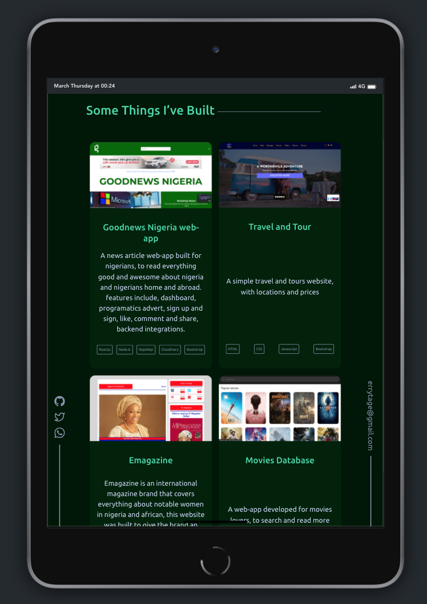
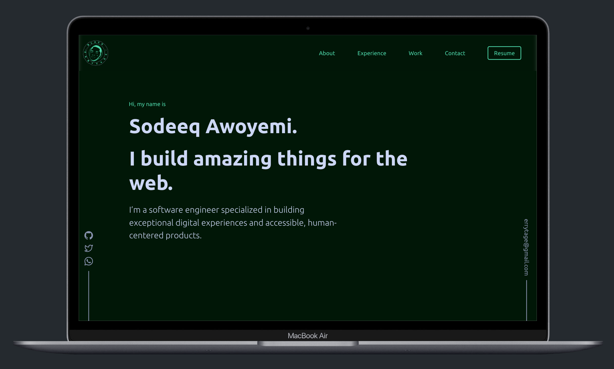
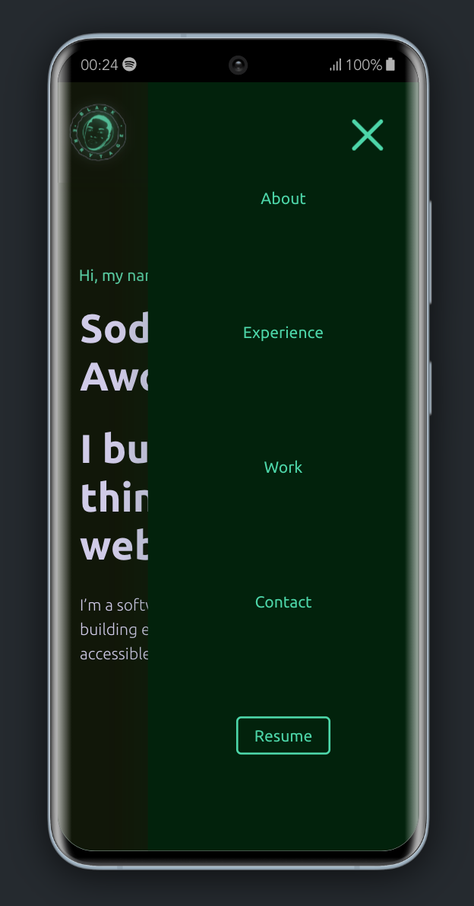

# Welcome to my personal portfolio website

Built with [Next.js](https://nextjs.org) (App Router) and [Tailwind CSS](https://tailwindcss.com).

## Live links

[codeeq.netlify.app](https://codeeq.netlify.app/)

## App Description

A portfolio website for Sodeeq Olaide Awoyemi.

## Tech Tools

1. [Next.js 15](https://nextjs.org) — App Router, static export of `/`, `next/image`, `next/font`.
2. [React 19](https://react.dev).
3. [Tailwind CSS 4](https://tailwindcss.com) — all styling, tokens defined in `src/app/globals.css`.
4. [Framer Motion](https://www.framer.com/motion/) — hero animations.
5. [AOS](https://michalsnik.github.io/aos/) — scroll reveal animations.

## Getting started

```bash
npm install
npm run dev     # http://localhost:3000
npm run build   # production build
npm start       # serve the production build
npm run lint
```

## Project structure

```
src/
  app/            layout, page and Tailwind entry (globals.css)
  assets/         images imported statically for next/image
  components/     UI, one folder per section
public/           favicon, manifest, resume PDF
```

## Preview




